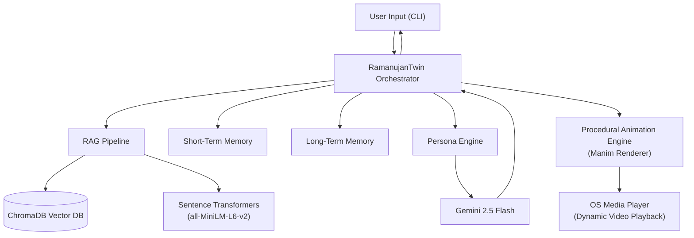

# 🧮 Digital Twin of Srinivasa Ramanujan

> *A RAG-powered AI that channels the mathematical intuition and personal character of the man who knew infinity, complete with a procedurally generated mathematical animation engine (Manim).*


---

## 🏗️ Architecture



The system works in a **6-step pipeline**:
1. **Retrieve** — RAG pipeline searches ChromaDB for relevant letters, notebooks, and biography context.
2. **Remember** — Short-term session history, key-value long-term profile states, and semantic vector memories are loaded.
3. **Construct** — The Persona Engine structures a system prompt injecting context, memories, and tone directives.
4. **Generate** — Gemini 2.5 Flash outputs a response in Ramanujan's voice.
5. **Intercept Payload** — The orchestrator intercepts and extracts custom ````json-visual```` blocks.
6. **Animate & Respond** — The chatbot text is displayed in a Rich CLI panel, and any visualization payload compiles a Manim video in a background subprocess, launching the OS media player automatically.

---

## 🧠 Memory System

The Digital Twin features a dual-layer memory system:
1. **Short-Term Memory**: Conversation turns from the active session are stored in memory and used as immediate conversation context (wiped on reset/quit).
2. **Long-Term Memory**:
   - **Key-Value State Memory (`vectordb/long_term.json`)**: Tracks persistent statistics across sessions, such as interaction count, topics explored, moments of wonder, and user mathematical level.
   - **Vector-Based Semantic Memory (`ramanujan_memories` collection in ChromaDB)**: Extracts personal facts about the user (e.g., name, background, current projects) on application exit using Gemini. These facts are embedded using `all-MiniLM-L6-v2` and searched at the start of each turn to dynamically recall user context and adapt responses in future sessions.

---

## 🚀 Quick Start

### Prerequisites
- Python 3.10+
- **FFmpeg** ([FFmpeg](https://www.ffmpeg.org/download.html?ref=bytevortex.tech)) installed on your system path (required by Manim for rendering video files).
- A [Google AI Studio](https://aistudio.google.com/) API key for Gemini.

### Setup & Ingestion
```bash
# 1. Clone the repository
git clone https://github.com/yourusername/digital-twin-ramanujan.git
cd digital-twin-ramanujan

# 2. Create and activate a virtual environment
python -m venv venv
venv\Scripts\activate     # On Windows
source venv/bin/activate  # On Linux/macOS

# 3. Install dependencies
pip install -r requirements.txt

# 4. Configure environment variables
# Copy .env.example to .env and add your GEMINI_API_KEY
cp .env.example .env

# 5. Ingest data files from data/raw/
python scripts/ingest.py --input data/raw/ --output data/processed/

# 6. Generate vector embeddings
python scripts/embed.py

# 7. Start the Digital Twin!
python demo.py
```

---

## 💬 Interactive Chat Commands

When you launch `python demo.py`, you enter the interactive chat interface. You must type your prompts at the **`[You] >>`** prompt.

> [!WARNING]
> **Do not run chat commands (like `/visualize` or `/stats`) directly in your Windows PowerShell or Command Prompt.** They are special commands that must be typed *inside* the active chatbot session at the `[You] >>` line.

### Available CLI Commands

| Command | Usage | Description |
|---------|-------|-------------|
| **/stats** | `[You] >> /stats` | View active system metrics (loaded documents, model parameters, memory size, and session token counts). |
| **/memory** | `[You] >> /memory` | View a summary of what Ramanujan has learned about you in long-term memory. |
| **/reset** | `[You] >> /reset` | Reset the active session conversation history (start fresh). |
| **/help** | `[You] >> /help` | Print out the list of available commands. |
| **/quit** | `[You] >> /quit` | Save all persistent memory files and exit the chatbot session safely. |
| **/visualize** | `[You] >> /visualize <topic>` | Force the system to generate a mathematical visualization animation for `<topic>`. |

---

## 🎨 Mathematical Visualization Engine

The project integrates the **Manim** animation engine. Instead of executing arbitrary LLM-generated code (which frequently crashes due to hallucinated syntax), the twin structures a parameter JSON payload that is executed by safe, pre-baked rendering scenes.

### 1. Integer Partitions (`/visualize partitions`)
- **Visuals:** Animates partition representations (Young/Ferrers diagrams) using grids of blocks.
- **Action:** Displays the first partition (e.g. $5$) and morphs the blocks using a smooth `ReplacementTransform` transition into the next partition (e.g. $4+1$, $3+2$, etc.) showing the exact arithmetic.

### 2. Continued Fractions (`/visualize continued fraction`)
- **Visuals:** Recursively lays out a continued fraction in real-time, scaling down nested nodes by `0.85` at each level.
- **Action:** Animates the fraction growing level-by-level, and computes/displays the exact convergent values ($c_0, c_1, c_2, \dots$) at the bottom of the screen.

### 3. Taxicab Numbers (`/visualize taxicab`)
- **Visuals:** Renders 3D GridCubes made up of smaller square sub-grids (e.g., $9 \times 9 \times 9$ and $10 \times 10 \times 10$ meshes).
- **Action:** Animates the cubes rotating in 3D camera angles to demonstrate spatial volume, and morphs them into a $1 \times 1 \times 1$ and $12 \times 12 \times 12$ arrangement to show they both sum up to $1729$.

---

## 📚 Ingesting Custom Data
To expand Ramanujan's knowledge base:
1. Place raw PDF or TXT files in `data/raw/`.
2. Run `python scripts/ingest.py --input data/raw/ --output data/processed/`.
3. Re-run `python scripts/embed.py` to embed and load them into ChromaDB.
---

*"An equation for me has no meaning unless it expresses a thought of God."*
— Srinivasa Ramanujan
