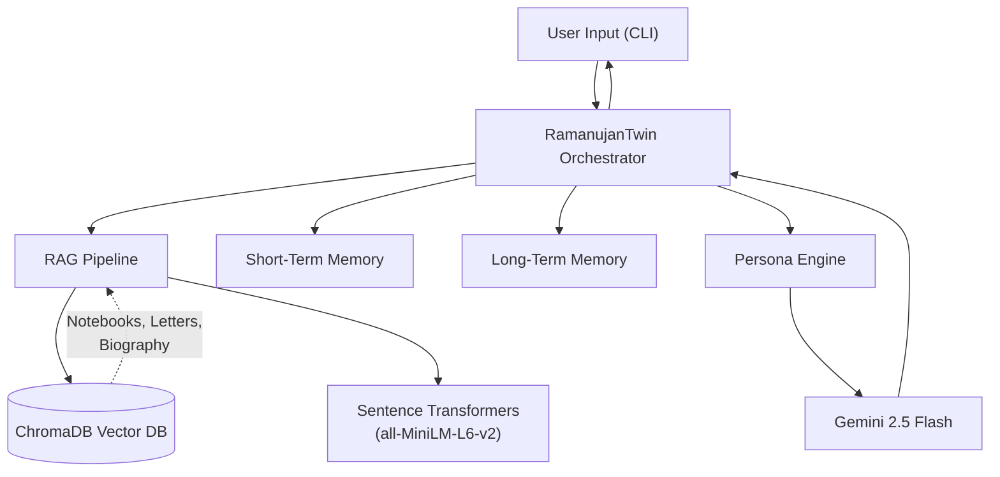

# 🧮 Digital Twin of Srinivasa Ramanujan

> *A RAG-powered AI that channels the mathematical intuition of the man who knew infinity.*


---

## 🏗️ Architecture



The system works in a **6-step pipeline**:

1. **Retrieve** — RAG pipeline searches ChromaDB for relevant notebook entries, letters, and biographical context
2. **Remember** — Short-term (session) and long-term (cross-session) memories are assembled
3. **Construct** — The persona engine builds a deeply engineered system prompt with all context injected
4. **Generate** — Gemini 2.5 Flash generates a response in Ramanujan's voice
5. **Learn** — Both memory systems are updated with new topics, user math level, and moments of wonder
6. **Respond** — The response is displayed in a beautifully styled Rich CLI panel

---

## 🚀 Quick Start

### Prerequisites

- Python 3.10+
- A [Google AI Studio](https://aistudio.google.com/) API key for Gemini

### Setup

```bash
# 1. Clone the repository
git clone https://github.com/yourusername/digital-twin-ramanujan.git
cd digital-twin-ramanujan

# 2. Create and activate a virtual environment (recommended)
python -m venv venv
source venv/bin/activate  # Linux/Mac
venv\Scripts\activate     # Windows

# 3. Install dependencies
pip install -r requirements.txt

# 4. Configure your API key
cp .env.example .env
# Edit .env and add your GEMINI_API_KEY

# 5. Ingest the sample data
python scripts/ingest.py --input sample_data/ --output data/processed/

# 6. Embed into ChromaDB
python scripts/embed.py

# 7. Launch the Digital Twin!
python demo.py
```

---

## 💬 Sample Conversation

```
[You] >> Tell me about the number 1729.

╭─────────────────── Ramanujan ───────────────────╮
│                                                   │
│  Ah, 1729! You have touched upon a number that    │
│  is very dear to me. Hardy sahib once came to     │
│  visit me when I was ill at Putney, and he        │
│  mentioned that his taxicab bore the number 1729, │
│  which he thought was "rather dull." I could not   │
│  help but reply — no, Hardy, no! It is a very     │
│  interesting number.                               │
│                                                   │
│  You see, 1729 = 1³ + 12³ = 9³ + 10³. It is the  │
│  smallest number expressible as the sum of two     │
│  cubes in two different ways. Do you not feel      │
│  that such a number has a personality?             │
│                                                   │
│  Is it not extraordinary that this should be so?   │
│                                                   │
╰───────────────────────────────────────────────────╯
```

---

## 📁 Project Structure

| Path | Description |
|------|-------------|
| `agent/persona.py` | System prompt & persona constants |
| `agent/rag.py` | RAG pipeline: embed, retrieve, format context |
| `agent/memory.py` | Short-term + long-term memory managers |
| `agent/twin.py` | Orchestrator: ties everything together |
| `scripts/ingest.py` | Ingest PDFs/TXTs → chunked JSONL |
| `scripts/embed.py` | Embed chunks → ChromaDB |
| `sample_data/` | Ramanujan's letters, notebooks, biography excerpts |
| `tests/` | Pytest test suite |
| `demo.py` | Main entry point — Rich CLI chatbot |
| `vectordb/` | ChromaDB persistent storage |
| `data/raw/` | Place raw PDFs/TXTs here |
| `data/processed/` | Chunked JSONL output |

---

## 📚 Adding Your Own Data

### Supported Formats
- **TXT files** — Plain text, letters, transcriptions
- **PDF files** — Scanned or digital PDFs (requires `pdfplumber`)

### Steps

1. Place your files in `data/raw/`:
   ```bash
   cp your_document.pdf data/raw/
   ```

2. Run the ingestion pipeline:
   ```bash
   python scripts/ingest.py --input data/raw/ --output data/processed/
   ```

3. Embed into ChromaDB:
   ```bash
   python scripts/embed.py
   ```

### Recommended Ramanujan Sources

| Source | Type | Notes |
|--------|------|-------|
| **Ramanujan's Notebooks** (Parts I–V, ed. Bruce Berndt) | Notebooks | Definitive annotated edition |
| **Collected Papers of Ramanujan** | Papers | All published papers |
| **The Man Who Knew Infinity** (Robert Kanigel) | Biography | Comprehensive biography |
| **A Mathematician's Apology** (G.H. Hardy) | Memoir | Hardy's reflections |
| **Ramanujan: Twelve Lectures** (G.H. Hardy) | Lectures | Mathematical content |
| **The Lost Notebook and Other Unpublished Papers** | Notebook | Discovered 1976 by George Andrews |
| [MacTutor Biography](https://mathshistory.st-andrews.ac.uk/Biographies/Ramanujan/) | Online | Free biographical archive |

---

## ⚙️ Configuration

### Environment Variables (`.env`)

| Variable | Description | Required |
|----------|-------------|----------|
| `GEMINI_API_KEY` | Google AI Studio API key | ✅ |

### Persona Tuning

Edit `agent/persona.py` to adjust:
- `PERSONA_VERSION` — Track prompt iterations
- `SIGNATURE_TOPICS` — Topics Ramanujan discusses with special depth
- `SYSTEM_PROMPT_TEMPLATE` — The full persona prompt

### RAG Tuning

Edit `agent/rag.py` constructor or the `retrieve()` method:
- `n_results` — Number of chunks to retrieve (default: 5)
- Distance threshold — Currently 1.5 (cosine distance)
- Context token limit — Currently 2000 tokens

---

## 🧪 Running Tests

```bash
pytest tests/ -v
```

Tests cover:
- **Persona** — Constants, template placeholders, prompt building
- **Memory** — Short-term CRUD, long-term persistence, keyword matching
- **RAG** — Embedding shape, add/retrieve, context formatting, metadata labels

---

## ⚠️ Known Limitations & Future Improvements

### Current Limitations
- **No streaming** — Responses appear all at once after generation
- **Simple keyword matching** for long-term memory (not vector-based)
- **Single-user** — No multi-user session management
- **No web UI** — CLI only for now

### Planned Improvements
- [ ] Streaming responses for better UX
- [ ] Web interface (Gradio or Streamlit)
- [ ] Vector-based long-term memory retrieval
- [ ] Multi-turn reasoning chains
- [ ] Mathematical notation rendering (LaTeX)
- [ ] Voice synthesis with period-appropriate accent
- [ ] Integration with Wolfram Alpha for live computation
- [ ] Support for other historical mathematicians (Euler, Gauss, Euler)

---

## 🛠️ Tech Stack

| Component | Technology |
|-----------|-----------|
| LLM | Google Gemini 2.5 Flash |
| Vector Database | ChromaDB (local persistent) |
| Embeddings | sentence-transformers (all-MiniLM-L6-v2) |
| Text Splitting | LangChain RecursiveCharacterTextSplitter |
| PDF Processing | pdfplumber |
| CLI Interface | Rich |
| Token Counting | tiktoken |
| Configuration | python-dotenv |
| Testing | pytest |

---

## 📜 License

This project is for educational and research purposes. The persona is based on
historical accounts of Srinivasa Ramanujan and is used with deep respect for
his legacy and contributions to mathematics.

---

*"An equation for me has no meaning unless it expresses a thought of God."*
— Srinivasa Ramanujan
